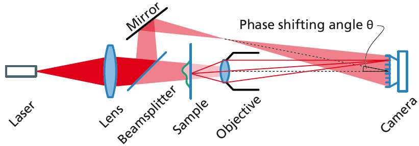

# HolMOS  Optics Design
Why are the optics arranged as they are?
There are reasons for many of the details in the HolMOS design.
Understanding the optics may be rewarding in itself, but it can also help in using and debugging the setup.

For an explanation of what to do to adjust an actual setup, [adjustment.md]() may be more helpful. 



## Laser, condensor lens
The laser is used without its collimation lens, so that it emits a divergent cone of light.
This makes adjustment easier: we only care about the (x,y) position of the point-like source.
If the laser is at a slight angle, the cone still hits most of the lens.
A collimated, line-like beam would be very sensitive: 
  a slight change in angle would make it miss whatever it was pointed at.

The condensor lens creates a beam converging into the objective, illuminating the sample from many angles.
Wikipedia explains why focussing your illuminating light into the objective is good: [Köhler illumination](https://en.wikipedia.org/wiki/K%C3%B6hler_illumination).

## Sample, objective, camera
This part of the beam behaves like a classical optical microscope.
Note that the RPi camera has tiny 1.12 µm pixels and a 4.6 mm diagonal.
Common microscopes use ~20 mm image diameter, so there is quite a mismatch here. 
This has two consequences:
* Magnification numbers are confusing: 
  Magnification appears stronger with the RPi than when using the same objective with and eyepiece. 
  With a "10x" objective, a 460 µm region of the sample is imaged onto the camera.
* Objectives are diffraction limited, not being designed to resolve such tiny pixels.

## Reference beam: beamsplitter, mirror
### Phase shifting angle α<sub>
To make this into an interferometer, an undisturbed reference beam is superimposed on the image.
If there is no sample, both waves are undisturbed.
In this case, the interference pattern is a set of bright/dark fringes filling the entire camera chip.
The spatial frequency k<sub>fringe</sub> is given by the wavelength λ and the angle α between the beams:
> k<sub>fringe</sub> = α / λ

The fringes need to be resolved by the camera.
A pattern of one light and one dark pixel can barely be resolved, known as the [Nyquist frequency](https://en.wikipedia.org/wiki/Nyquist_frequency).
This is also the spatial frequency that corresponds to the edges of the FFT:
> k<sub>max</sub> = 1 / 2px 

Combining this, the angle that gives a barely resolvable interference pattern is:
> α<sub>max</sub> = λ / 2px

(...using lazy-physicist-maths: sin(x)=tan(x)=x and angles are fractions of 2π instead of 360°, see [Radian](https://en.wikipedia.org/wiki/Radian))

For a red laser (λ = 633 nm) and the RPi camera (px = 2 * 1.12µm, using only the red pixels):
> α<sub>max</sub> = 0.177

In reality, the diffraction order is not a point, but an area, so we want the actual angle to be smaller.
Ideally, a section through the FFT looks like this:
```
-k_max    -α             0            +α    +k_max
   |       |             |             |       |
   |....*******....XXXXXXXXXXXXX....*******....|
        -diff           DC           +diff
```
The`DC` term that is always present, even from the object beam by itself.
The two `diff`raction orders appear as soon as interference happens.

The position of the diffraction terms is given by the angle α.
Converting the aperture size of the objective to an angle gives the with of the diffraction terms.
The DC term is twice as large as the diffraction orders.

To make everything fit nicely into the FFT, the optimum angle is α<sub>opt</sub> = 3/4 * α<sub>max</sub> = 0.13.

The current reference design uses a slightly larger value, α = 35mm / 300mm = 0.12. 
That is still well below α<sub>max</sub>, but makes getting the beam past the objective easier in real life.

### Reference beam focus
The object beam is not a plane wave when it arrives at the camera, not even if there is no object.
Imagine the objective had a very tiny aperture, like a pinhole camera: 
  all of the object beam comes from the inside the aperture, so the wavefronts are cirular.
  
Although the angles are small due to the small camera chip, it is nice to have a flat phase image.
To achieve this, the reference beam needs to have the same curvature when the beams interfere:
  the entire reference beam should come from a single point that is the same distance from the camera as the objective.
Luckily, the condensor lens creates a focus in the reference beam - should be roughly next to the objective.
